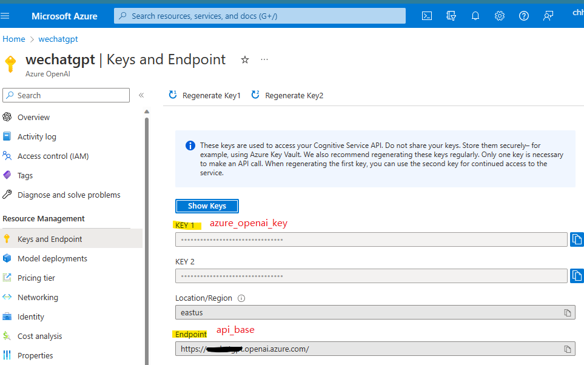
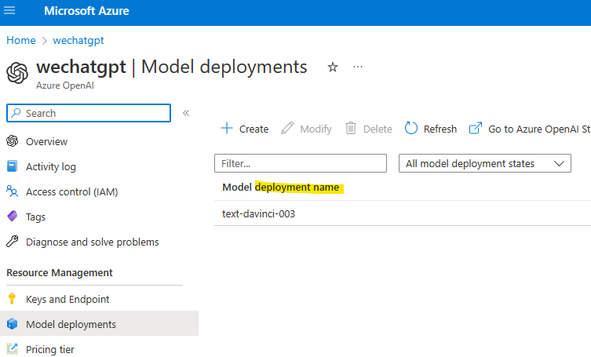
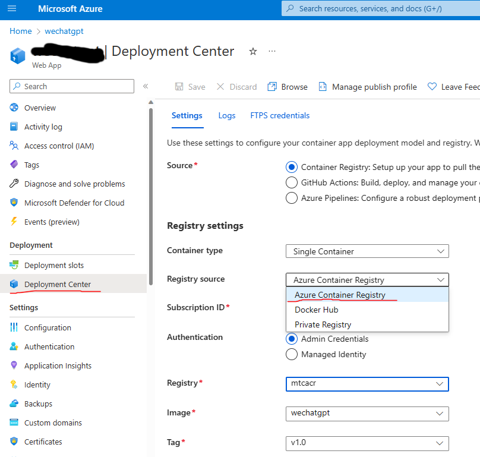

# WechatGPT

## 目标

Flask+Docker 部署的微信公众号机器人对接 ChatGPT 或 fine-tuned OpenAI model on Azure
模拟 ChatGPT 多轮对话中保持上下文
欢迎小伙伴贡献代码

- main.py 入口
- bot.py 负责对接 API

## 运行前

- 将文件 config template.py 改名为 config.py
- 并根据自己账号更改里面的 key

## Azure OpanAI服务配置
如果调用Azure上的OpenAIAPI，需要修改config.py上的几个参数，其中
- azure_openai_key 和 api_base

- deployment_name

- Azure EastUS 区目前可以部署Davinci-003模型

## 在 Azure Web App服务上部署Docker Image
创建Web App Service, 并指定Docker Image Repo

## 在微信公众号后台配置指向 Azure Web App

Copy Azure Web App & Paste 到微信公众号后台的“服务器配置” 里

